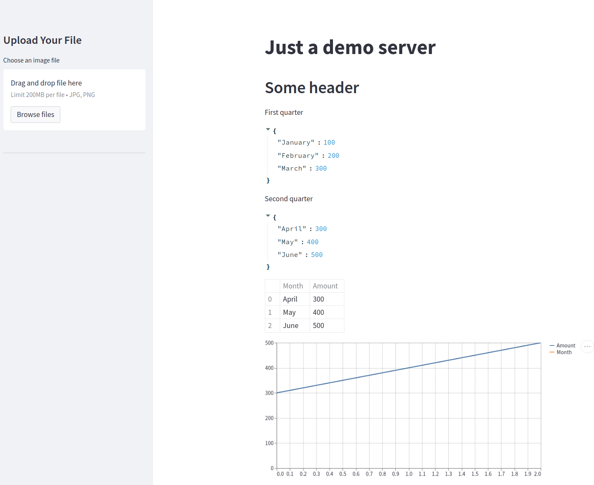

# A simple Data Science web environment for image classification

### This demo docker composition provides
* A simple **Flask** server providing a classification service as REST endpoint, provisioned via **Gunicorn**
  * This one will provide it's services at http://yourwebservice:5000 / http://localhost:5000 
* A simple **Streamlit** application which shows how to fetch information from your Flask server or send a custom image to it to classify it
    * This one you can reach in your browser via http://localhost:5002
* A simple **REDIS** docker setup via which you can communicate between your single microservices
  * This one you can reach from within the docker containers and your local machine at yourredis:6379
  * See [here](https://betterprogramming.pub/getting-started-with-redis-a-python-tutorial-3a18531a73a6) for several examples how to share workload or information via Redis between multiple containers.
    
### To get started
* Install the newest version of [Docker](https://docs.docker.com/engine/install/ubuntu/) and [Docker Compose](https://docs.docker.com/compose/install/) if not done so yet in your Linux environment
* Open a terminal and move to the root directory of this project
* Execute `docker-compose up --build --remove-orphans` to wind all services up
* Open the page http://localhost:5002 in your browser
* Have fun!
  
### Notes:
* Gunicorn and streamlit are (by default) configured in a way that they point to your local source code directories
  * To refresh a Streamlit page of the ui you just need to save the source file in the uifrontend folder
  * To refresh a Gunicorn services just save the source file and re-execute it via the ui or refresh the page in the browser
  * If you want to deploy your containers and need to bundle your source code see the TODOs in the Dockerfiles and
    in docker-compose.yml.
* In case you closed your terminal the service will stay alive even after reboots, to stop it: 
Go to the root directory of this project and execute `docker-compose down`